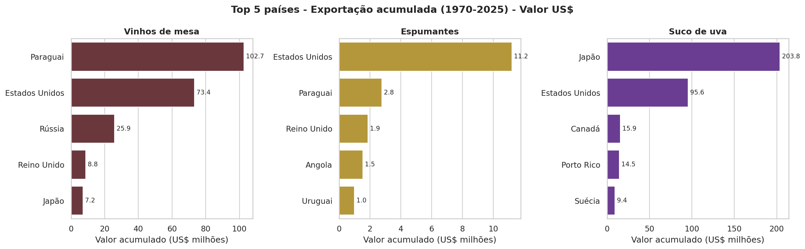
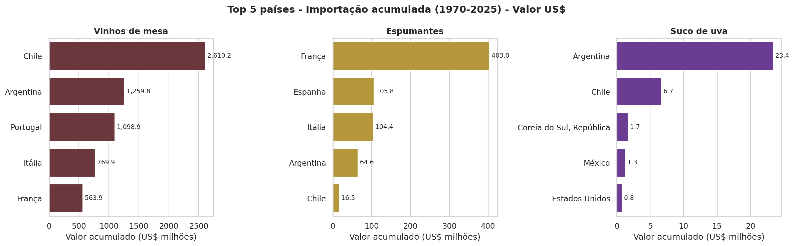
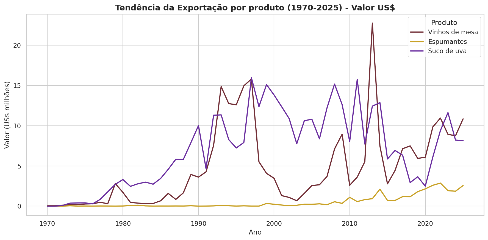
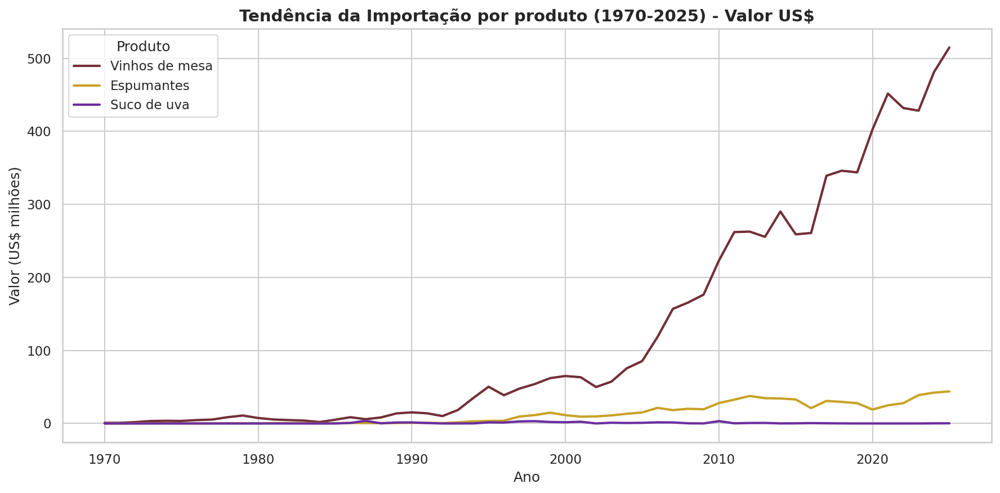
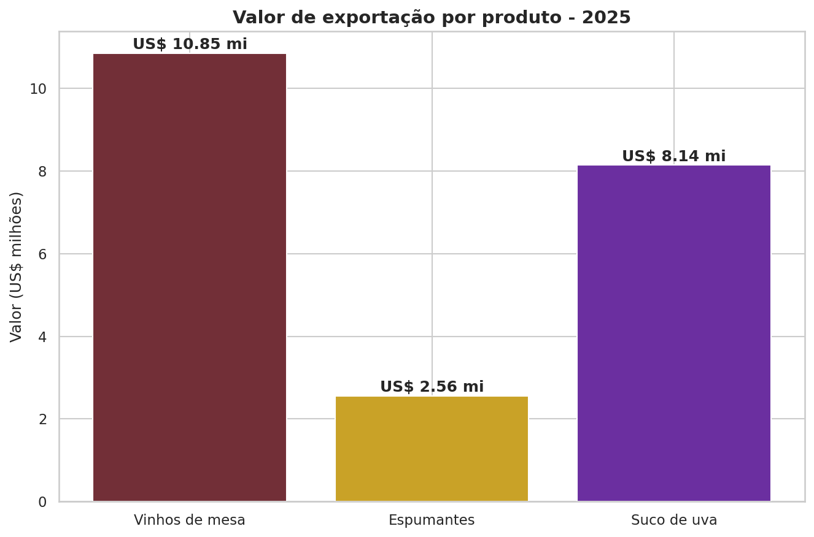
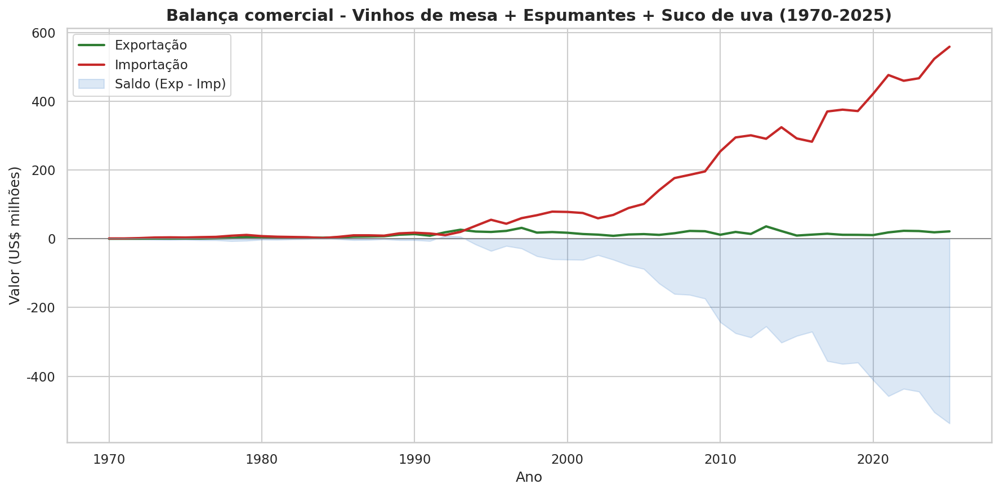

# Prova Substitutiva — POSTECH Data Analytics (Fase 1)

**Análise de Exportação e Importação: Vinhos de Mesa, Espumantes e Sucos de Uva**

   

Este repositório contém a entrega completa da prova de Data Analytics: uma análise de dados da vitivinicultura brasileira solicitada pelos diretores de uma empresa de vinhos no Brasil, com base na série histórica oficial de 1970 a 2025 da **Embrapa Uva e Vinho (Vitibrasil)**.

> **Fonte de dados:** [Vitibrasil — Banco de dados de uva, vinho e derivados](http://vitibrasil.cnpuv.embrapa.br/index.php?opcao=opt_01)

---

## Entregas

| Entrega | Arquivo | Descrição |
|---|---|---|
| **1. Código Python** | [`analise_vitibrasil.py`](analise_vitibrasil.py) | Script comentado com o pipeline completo: extração (download dos CSVs oficiais), transformação (limpeza e padronização) e análise (rankings, tendências, KPIs e gráficos) |
| **2. Apresentação com storytelling** | [`apresentacao/Apresentacao_Vitivinicultura_Brasil.pdf`](apresentacao/Apresentacao_Vitivinicultura_Brasil.pdf) | Relatório executivo em 12 slides para os diretores (também disponível em [PPTX](apresentacao/Apresentacao_Vitivinicultura_Brasil.pptx)) |

As respostas detalhadas às 7 perguntas de negócio estão em [`docs/respostas_perguntas_negocio.md`](docs/respostas_perguntas_negocio.md).

## Como executar

```bash
# 1. Clone o repositório
git clone https://github.com/hbvictorio/prova-data-analytics-henrique-victorio.git
cd prova-data-analytics-henrique-victorio

# 2. Instale as dependências
pip install -r requirements.txt

# 3. Execute a análise (baixa os dados da Embrapa e gera os gráficos)
python3 analise_vitibrasil.py
```

O script baixa automaticamente os 6 arquivos CSV oficiais da Embrapa, gera a base consolidada (`base_consolidada_vitibrasil.csv`) e exporta os 8 gráficos para a pasta `graficos/`. Os dados originais também estão versionados em [`data/originais/`](data/originais/) para reprodutibilidade, e o log de execução com todos os resultados numéricos está em [`docs/resultados_analise.txt`](docs/resultados_analise.txt).

## Estrutura do repositório

```
prova-data-analytics-henrique-victorio/
├── README.md                          ← este arquivo
├── analise_vitibrasil.py              ← ENTREGA 1: código Python comentado
├── requirements.txt                   ← dependências
├── apresentacao/
│   ├── Apresentacao_Vitivinicultura_Brasil.pdf    ← ENTREGA 2: apresentação (PDF)
│   └── Apresentacao_Vitivinicultura_Brasil.pptx   ← versão editável (PowerPoint)
├── docs/
│   ├── respostas_perguntas_negocio.md ← respostas detalhadas às 7 perguntas
│   └── resultados_analise.txt         ← log de execução do script
├── data/
│   ├── originais/                     ← 6 CSVs oficiais da Embrapa (sem alterações)
│   └── base_consolidada_vitibrasil.csv← base tratada (formato tidy)
└── graficos/                          ← 8 gráficos PNG gerados pelo código
```

---

## Resumo dos resultados

### P1 — País com maior exportação (acumulado 1970–2025, valor US$)

| Produto | País líder | Valor acumulado | Volume acumulado |
|---|---|---|---|
| Vinhos de mesa | **Paraguai** | US$ 102,7 milhões | 127,6 mi Kg |
| Espumantes | **Estados Unidos** | US$ 11,2 milhões | 3,97 mi Kg |
| Suco de uva | **Japão** | US$ 203,8 milhões | 95,4 mi Kg |



### P2 — País com maior importação (acumulado 1970–2025, valor US$)

| Produto | País líder | Valor acumulado | Volume acumulado |
|---|---|---|---|
| Vinhos de mesa | **Chile** | US$ 2,61 bilhões | 981,1 mi Kg |
| Espumantes | **França** | US$ 403,0 milhões | 38,1 mi Kg |
| Suco de uva | **Argentina** | US$ 23,4 milhões | 28,0 mi Kg |



### P3 — Tendência da exportação ao longo dos anos

Exportações historicamente **voláteis e dependentes de poucos compradores**: picos dos vinhos de mesa em 1993–1997 e recorde em 2013 (~US$ 23 mi, puxado pela Rússia); suco de uva sustentado por Japão/EUA até meados dos anos 2010; espumantes são a única categoria com tendência estrutural de alta desde 2010.



### P4 — Tendência da importação ao longo dos anos

Importações de vinhos de mesa **cresceram mais de 10x desde 2000**, com inflexão nos anos 1990 (abertura comercial, Plano Real, Mercosul) e recorde histórico de **~US$ 515 milhões em 2025**. A importação de suco de uva é praticamente nula (autossuficiência nacional).



### P5 — Cenário da produção nacional

O Brasil é o **11º maior produtor mundial de vinhos** e 14º de uvas (~85 mil ha plantados). O Rio Grande do Sul concentra ~90% do processamento nacional; o Vale do São Francisco (PE/BA) cresce com viticultura tropical irrigada (até 2,5 safras/ano). A safra 2024 caiu 41% (chuvas extremas no RS, OIV), com recuperação robusta em 2025. Espumantes cresceram +16,9% no 1º semestre de 2025, enquanto o suco de uva enfrenta queda de demanda doméstica.

### P6 — Clima favorável à produção

A tríade climática essencial: **amplitude térmica** (dias quentes e noites frias), **maturação/colheita seca** e **inverno frio bem definido**, complementados por temperatura de 13–21°C na estação de crescimento, alta insolação na maturação e solos bem drenados (pH 5,5–6,5). No Brasil: Serra Gaúcha (espumantes), Campanha Gaúcha (tintos finos) e Vale do São Francisco (exceção tropical irrigada).

### P7 — Exportações no ano mais recente da base (2025)

| Produto | Valor (US$) | Volume (Kg/L) | Preço médio (US$/L) |
|---|---|---|---|
| Vinhos de mesa | 10.846.438 | 6.540.975 | 1,66 |
| Suco de uva | 8.142.080 | 3.029.975 | 2,69 |
| Espumantes | 2.560.852 | 683.060 | 3,75 |
| **Total** | **21.549.370** | **10.254.010** | — |



### Insight central — Balança comercial

> Para cada **US$ 1 exportado**, o Brasil importa **US$ 26** nas três categorias (2025: US$ 21,5 mi exportados vs ~US$ 560 mi importados) — o maior déficit da série histórica. O mercado interno, aquecido e em crescimento na contramão do mundo, é o grande campo de batalha estratégico.



---

## Notas metodológicas

- **Critério de ranking:** valor acumulado em US$ (volume em Kg como métrica complementar).
- **Equivalência:** 1 Kg ≈ 1 L para vinhos e espumantes (convenção da Embrapa, densidade ~1).
- **Limpeza:** linhas agregadoras ("Total", "Outros", "Não consta na tabela", "Não declarados") foram excluídas dos rankings.
- **Recorte temporal:** 1970–2025; dados de 2025 refletem a última atualização da base (05/09/2025) e podem ser parciais.

## Fontes externas (perguntas 5 e 6)

- [OIV — State of the World Vine and Wine Sector 2024](https://www.oiv.int/sites/default/files/2025-04/OIV-State_of_the_World_Vine-and-Wine-Sector-in-2024.pdf)
- [USDA/FAS — Brazilian Grape and Wine Market Overview (BR2026-0021)](https://www.fas.usda.gov/data/gain-report/2026/05/Brazilian%20Grape%20and%20Wine%20Market%20Overview_Brasilia_Brazil_BR2026-0021.pdf)
- [Portal A Vindima — Suco de uva em queda, espumantes em alta (ago/2025)](https://www.avindima.com.br/suco-de-uva-em-queda-espumantes-em-alta/)
- Embrapa Uva e Vinho — publicações técnicas sobre clima e viticultura, e dados do IBGE/Sisdevin

---

*Trabalho desenvolvido para a Prova Substitutiva da POSTECH — Data Analytics, Fase 1.*
